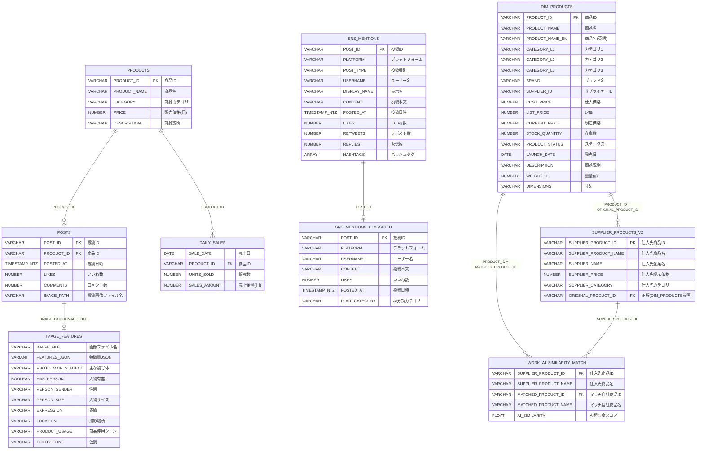

# AI_HANDSON_DB.ANALYTICS ER図

```mermaid
erDiagram
    %% ===== 商品・投稿系 =====

    PRODUCTS {
        VARCHAR PRODUCT_ID PK "商品ID"
        VARCHAR PRODUCT_NAME "商品名"
        VARCHAR CATEGORY "商品カテゴリ"
        NUMBER  PRICE "販売価格(円)"
        VARCHAR DESCRIPTION "商品説明"
    }

    POSTS {
        VARCHAR       POST_ID PK "投稿ID"
        VARCHAR       PRODUCT_ID FK "商品ID"
        TIMESTAMP_NTZ POSTED_AT "投稿日時"
        NUMBER        LIKES "いいね数"
        NUMBER        COMMENTS "コメント数"
        VARCHAR       IMAGE_PATH "投稿画像ファイル名"
    }

    IMAGE_FEATURES {
        VARCHAR IMAGE_FILE "画像ファイル名"
        VARIANT FEATURES_JSON "特徴量JSON"
        VARCHAR PHOTO_MAIN_SUBJECT "主な被写体"
        BOOLEAN HAS_PERSON "人物有無"
        VARCHAR PERSON_GENDER "性別"
        VARCHAR PERSON_SIZE "人物サイズ"
        VARCHAR EXPRESSION "表情"
        VARCHAR LOCATION "撮影場所"
        VARCHAR PRODUCT_USAGE "商品使用シーン"
        VARCHAR COLOR_TONE "色調"
    }

    DAILY_SALES {
        DATE    SALE_DATE "売上日"
        VARCHAR PRODUCT_ID FK "商品ID"
        NUMBER  UNITS_SOLD "販売数"
        NUMBER  SALES_AMOUNT "売上金額(円)"
    }

    PRODUCTS ||--o{ POSTS : "PRODUCT_ID"
    PRODUCTS ||--o{ DAILY_SALES : "PRODUCT_ID"
    POSTS    ||--o| IMAGE_FEATURES : "IMAGE_PATH = IMAGE_FILE"

    %% ===== SNS分析系 =====

    SNS_MENTIONS {
        VARCHAR       POST_ID PK "投稿ID"
        VARCHAR       PLATFORM "プラットフォーム"
        VARCHAR       POST_TYPE "投稿種別"
        VARCHAR       USERNAME "ユーザー名"
        VARCHAR       DISPLAY_NAME "表示名"
        VARCHAR       CONTENT "投稿本文"
        TIMESTAMP_NTZ POSTED_AT "投稿日時"
        NUMBER        LIKES "いいね数"
        NUMBER        RETWEETS "リポスト数"
        NUMBER        REPLIES "返信数"
        ARRAY         HASHTAGS "ハッシュタグ"
    }

    SNS_MENTIONS_CLASSIFIED {
        VARCHAR       POST_ID FK "投稿ID"
        VARCHAR       PLATFORM "プラットフォーム"
        VARCHAR       USERNAME "ユーザー名"
        VARCHAR       CONTENT "投稿本文"
        NUMBER        LIKES "いいね数"
        TIMESTAMP_NTZ POSTED_AT "投稿日時"
        VARCHAR       POST_CATEGORY "AI分類カテゴリ"
    }

    SNS_MENTIONS ||--o| SNS_MENTIONS_CLASSIFIED : "POST_ID"

    %% ===== 名寄せデモ系 =====

    DIM_PRODUCTS {
        VARCHAR PRODUCT_ID PK "商品ID"
        VARCHAR PRODUCT_NAME "商品名"
        VARCHAR PRODUCT_NAME_EN "商品名(英語)"
        VARCHAR CATEGORY_L1 "カテゴリ1"
        VARCHAR CATEGORY_L2 "カテゴリ2"
        VARCHAR CATEGORY_L3 "カテゴリ3"
        VARCHAR BRAND "ブランド名"
        VARCHAR SUPPLIER_ID "サプライヤーID"
        NUMBER  COST_PRICE "仕入価格"
        NUMBER  LIST_PRICE "定価"
        NUMBER  CURRENT_PRICE "現在価格"
        NUMBER  STOCK_QUANTITY "在庫数"
        VARCHAR PRODUCT_STATUS "ステータス"
        DATE    LAUNCH_DATE "発売日"
        VARCHAR DESCRIPTION "商品説明"
        NUMBER  WEIGHT_G "重量(g)"
        VARCHAR DIMENSIONS "寸法"
    }

    SUPPLIER_PRODUCTS_V2 {
        VARCHAR SUPPLIER_PRODUCT_ID PK "仕入先商品ID"
        VARCHAR SUPPLIER_PRODUCT_NAME "仕入先商品名"
        VARCHAR SUPPLIER_NAME "仕入先企業名"
        NUMBER  SUPPLIER_PRICE "仕入先提示価格"
        VARCHAR SUPPLIER_CATEGORY "仕入先カテゴリ"
        VARCHAR ORIGINAL_PRODUCT_ID FK "正解(DIM_PRODUCTS参照)"
    }

    WORK_AI_SIMILARITY_MATCH {
        VARCHAR SUPPLIER_PRODUCT_ID FK "仕入先商品ID"
        VARCHAR SUPPLIER_PRODUCT_NAME "仕入先商品名"
        VARCHAR MATCHED_PRODUCT_ID FK "マッチ自社商品ID"
        VARCHAR MATCHED_PRODUCT_NAME "マッチ自社商品名"
        FLOAT   AI_SIMILARITY "AI類似度スコア"
    }

    DIM_PRODUCTS          ||--o{ SUPPLIER_PRODUCTS_V2 : "PRODUCT_ID = ORIGINAL_PRODUCT_ID"
    DIM_PRODUCTS          ||--o{ WORK_AI_SIMILARITY_MATCH : "PRODUCT_ID = MATCHED_PRODUCT_ID"
    SUPPLIER_PRODUCTS_V2  ||--o{ WORK_AI_SIMILARITY_MATCH : "SUPPLIER_PRODUCT_ID"
```
